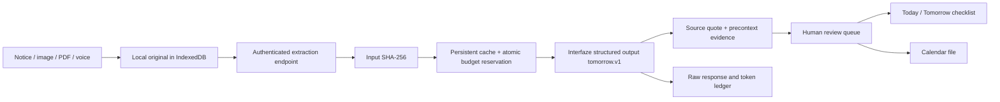

# Tomorrow

**School messages in. A calmer tomorrow out.**

Tomorrow turns a school notice, screenshot, PDF or voice note into a checklist a
parent can verify: what to do, what to pack, and when to be there. **Interfaze is the
only AI/extraction provider.** No alternative OCR engine and no fabricated AI output.

Live app: https://tomorrow-family.vercel.app

Public MIT source: https://github.com/imranrkhan13/tomorrow-family

## Use it

1. Add a notice: paste text or upload a file up to 3 MB.
2. Assign a child optionally and consent to sending the notice to Interfaze.
3. Review extracted task, date and time against the original. Every task needs confirmation.
4. Check Today, Tomorrow or All reminders. Mark things packed/done.
5. Export confirmed dated reminders to an `.ics` calendar file.

Original notices and tasks persist in IndexedDB on the current browser/device.
The library supports search and child filters. Manual reminders and local notice
saving work without AI access. Download your data as JSON, including original files.
Settings & connection can restore a version 1 JSON backup on this device. Restore validates the entire file and replaces local data in one transaction only after confirmation; download the current data first. It does not change server cache records or make provider calls.

## Run locally

Node 22 recommended:

```sh
npm ci
cp .env.example .env.local
# Fill INTERFAZE_API_KEY, confirm unused FREE credits, and set caps.
npm run dev
```

Open http://127.0.0.1:5174 . Local dev binds loopback only, uses a persistent private
file cache, and does not need Redis or a household access code. No key is bundled
into the browser. Never use `VITE_`-prefixed secrets.

```sh
npm run verify
```

Tests and builds require no API key and use a genuine response to an original
fictional notice, plus explicitly mocked failure transports. No test makes real
API requests. `scripts/smoke.ts` and `scripts/image-smoke.ts` are opt-in live checks;
they use persistent cache and do not automatically repeat a submitted input.

## Hosted deployment

Vercel Hobby serves the web app and `/api/status` / `/api/extract`. Configure the
server-only environment variables from `.env.example`, and provision a **free**
Upstash Redis database with eviction and auto-upgrade disabled. Redis is infrastructure,
not an AI provider. Hosted extraction refuses to run without a persistent cache.
The deployment uses a household access code (minimum 16 characters), entered under
Settings. It is held only in sessionStorage; it is not an Interfaze key.

This is a **single-household pilot**, not a multi-tenant service. Anyone with its
household code can consume its shared capped budget. Do not publish that code.
Changing the code does not change the provider key or reset cached calls.

## How it works



Audio uses two Interfaze calls: transcription, then extraction. This is not
one call per audio input. Each stage has its own durable cache entry. Transcript offsets link text, not acoustic truth.
Images use OCR precontext boxes when uniquely matched; unsupported metadata or
quotes are labeled unverified. PDFs retain the original for comparison; page-level
box overlays are not implemented. Relative or ambiguous dates must stay blank
unless the source has an explicit dated anchor; all proposed dates require review.

## Cost and failure behavior

- No automatic retries or fallback models. Same input bytes and text reuse the
  cached result, even if filenames or prompts change. Filename is not cache identity.
- A durable pending record is written before each request. Uncertain, failed,
  truncated, malformed or unmetered calls halt further spending. Cached successful
  notices remain readable. Never delete pending entries just to retry.
- Reserve 1,032,000 tokens and $1.612 before each call (documented full context and
  output limits). Completion has an explicit 6,000-token maximum (4,096 for
  transcription). Interfaze multipass preprocessing can add billed input tokens,
  so client file and text limits do not prove a lower per-call spend ceiling.
  Settle actual usage afterward. Caps default to zero; the hosted pilot
  uses a $2 allocation from the user's stated $20 free balance. Other clients'
  account usage cannot be monitored by this app.
- Provider prices used: $1.50/M input, $3.50/M output, checked September 27, 2026 at https://interfaze.ai/pricing. Input accounting caveat:
  https://interfaze.ai/docs/faqs.
  Unexpected usage above the reservation halts future calls. Upstream limits and
  accounting remain outside application control.
- Serial global reservation plus 1-second admission spacing stays below 50 req/s.
  A browser-local UUID is admitted for at most six new stages per hour; this
  per-device throttle is a convenience control, not a strong identity or abuse barrier.
  A failed browser response can check the persisted result without resubmitting;
  no automatic retry occurs.
  Request timeout is 280 seconds for image/text/PDF; audio gives each of two stages
  140 seconds so the full request fits the 300-second function limit.
- Input cap is 3 MB, below Interfaze's 20 MB maximum, to fit Vercel's request body
  limit after base64 encoding. Oversized files are rejected before any API call.
- The raw provider response is private server cache data. A browser-local deletion
  does not delete it. The owner must handle server deletion deliberately because
  removing a cache entry also removes repeat-call protection.

## Validation and limits

A genuine text smoke test on September 27, 2026 extracted three expected tasks
from one fictional notice: permission slip due September 28, a September 29 trip
at 08:30, and water/lunch to bring. All three titles linked to source lines. Usage:
12,466 tokens, $0.021307, 20.13 seconds. UI replay consumed no additional tokens.
This single smoke test is **not** an accuracy benchmark or confidence calibration.
See `docs/VALIDATION.md` for subsequent modality checks and limitations.

The UI has no fabricated example results and starts with an empty household.
There is no background email access, school-app integration, push notification,
account login, cross-device sync, automated cancellation handling, or PDF page
highlighting. Calendar files use floating local times; review timezone settings
when importing. School closures, last-minute changes, OCR errors and ambiguous
notices always require a person. This pilot is not a replacement for official
school communications.

MIT code. Original fictional example notice: CC0. Genuine response fixtures contain
only that fictional content. Keys, access codes, actual family notices and private
cache files are excluded from Git and deployment uploads.

Sources: [Interfaze docs](https://interfaze.ai/docs),
[structured output](https://interfaze.ai/docs/structured-output),
[precontext](https://interfaze.ai/docs/precontext),
[file handling](https://interfaze.ai/docs/handling-files),
[pricing](https://interfaze.ai/pricing).
